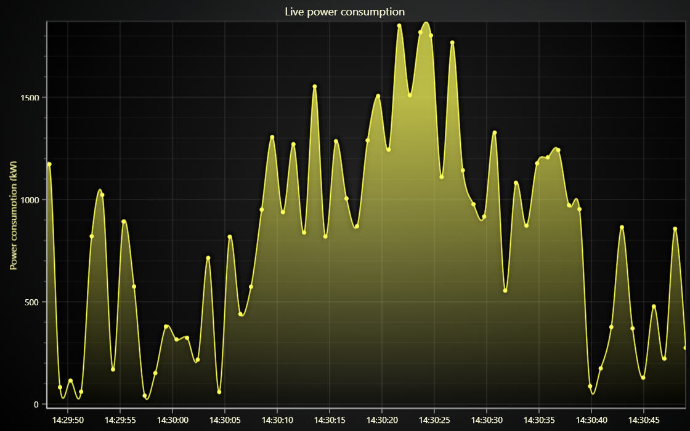

# JavaScript Spline Line Chart



This demo application belongs to the set of examples for LightningChart JS, data visualization library for JavaScript.

LightningChart JS is entirely GPU accelerated and performance optimized charting library for presenting massive amounts of data. It offers an easy way of creating sophisticated and interactive charts and adding them to your website or web application.

The demo can be used as an example or a seed project. Local execution requires the following steps:

-   Make sure that relevant version of [Node.js](https://nodejs.org/en/download/) is installed
-   Open the project folder in a terminal:

          npm install              # fetches dependencies
          npm start                # builds an application and starts the development server

-   The application is available at _http://localhost:8080_ in your browser, webpack-dev-server provides hot reload functionality.


## Description

This example shows how to draw and style spline-series.

First create the series using chart method.

```javascript
// Add a spline series using default X and Y axes.
const splineSeries = chart.addSplineSeries()
```

## Option 1: Styling using a style object.

The first option for styling of series is to create a new object that contains the necessary information about visual settings. In the case of line-series, the object must be type of _SolidLine_ to be visible.

```javascript
// Create a new instance of visible solid line-style.
const strokeStyle = new SolidLine()
    // Set desired fill style of the stroke.
    .setFillStyle(
        // SolidLine can have only SolidFill fill-style.
        new SolidFill().setColor(ColorRGBA(96, 204, 232)),
    )
    // Set thickness of the stroke.
    .setThickness(5.0)

// Apply styling settings to the series.
splineSeries.setStrokeStyle(strokeStyle)
```

## Option 2: Styling using a mutator function.

Usually, it can be even more easy to simply modify the existing _Style_ of a component, rather than constructing a new one. This is done using so-called _mutator-functions_. Here's an example:

```javascript
// Modify the previous Stroke style of a SplineSeries, by overriding its previous thickness.
splineSeries.setStrokeStyle((strokeStyle) => strokeStyle.setThickness(1.0))
```

Our coding practices include fluent, self-returning API, which allows us to easily call multiple setters in one statement.

```javascript
splineSeries
    .setStrokeStyle(strokeStyle)
    // 'transparentFill' is a static constant
    // that needs to be imported from the library in order to be used.
    // It is used to draw things with transparent fill that aren't disposable
    // - like the points of a PointLineSeries.
    .setPointFillStyle(transparentFill)
```


## API Links

* [Solid LineStyle]
* [Solid FillStyle]
* [Transparent FillStyle]
* [RGBA color factory]
* [XY cartesian chart]
* [Spline series]
* [Scroll strategies]
* [Progressive random data generator]


## Support

If you notice an error in the example code, please open an issue on [GitHub][0] repository of the entire example.

Official [API documentation][1] can be found on [LightningChart][2] website.

If the docs and other materials do not solve your problem as well as implementation help is needed, ask on [StackOverflow][3] (tagged lightningchart).

If you think you found a bug in the LightningChart JavaScript library, please contact sales@lightningchart.com.

Direct developer email support can be purchased through a [Support Plan][4] or by contacting sales@lightningchart.com.

[0]: https://github.com/Arction/
[1]: https://lightningchart.com/lightningchart-js-api-documentation/
[2]: https://lightningchart.com
[3]: https://stackoverflow.com/questions/tagged/lightningchart
[4]: https://lightningchart.com/support-services/

© LightningChart Ltd 2009-2025. All rights reserved.


[Solid LineStyle]: https://lightningchart.com/js-charts/api-documentation/v8.1.0/classes/SolidLine.html
[Solid FillStyle]: https://lightningchart.com/js-charts/api-documentation/v8.1.0/classes/SolidFill.html
[Transparent FillStyle]: https://lightningchart.com/js-charts/api-documentation/v8.1.0/variables/transparentFill.html
[RGBA color factory]: https://lightningchart.com/js-charts/api-documentation/v8.1.0/functions/ColorRGBA.html
[XY cartesian chart]: https://lightningchart.com/js-charts/api-documentation/v8.1.0/classes/ChartXY.html
[Spline series]: https://lightningchart.com/js-charts/api-documentation/v8.1.0/classes/PointLineAreaSeries.html
[Scroll strategies]: https://lightningchart.com/js-charts/api-documentation/v8.1.0/variables/AxisScrollStrategies.html
[Progressive random data generator]: https://lightning-chart.github.io/xydata/classes/progressiverandomgenerator.html

